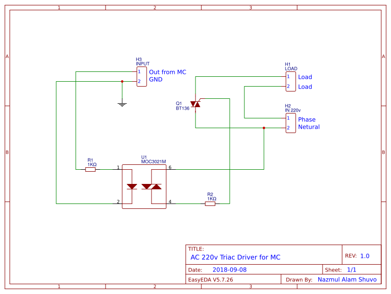
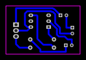
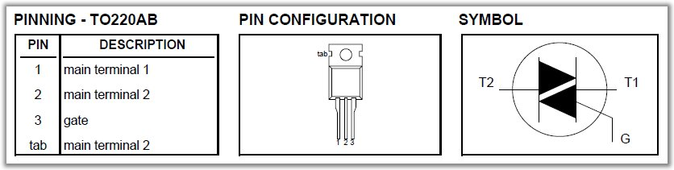
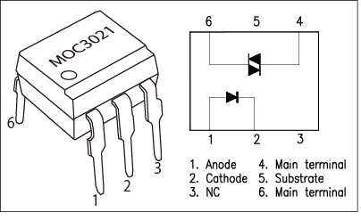

# AC-220v-Triac-Driver-for-microcontroller
AC220v Triac Driver for Microcontroller. Just Input 5v in INPUT in this circuit. Easy and simple circuit.

## Here are Circuit Diagram:

## Here are PCB Layout:

## Here are PIN OUT For BT136 & MOC3021:

## LINK for Parts List:

https://easyeda.com/nazmul.shuvo2/AC220v-Triac-Driver-for-Microcontroller

HappY Electronics :D 

